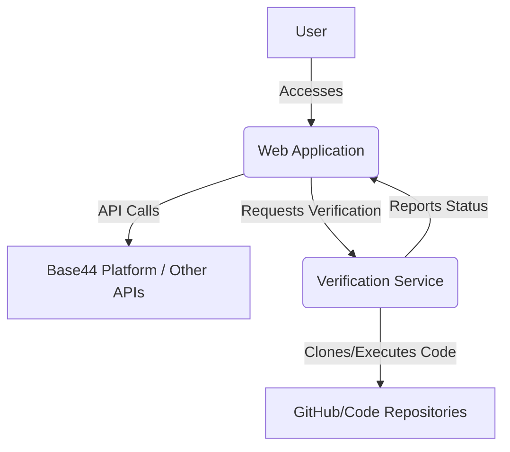

# CodeConsul Architecture Overview

This document outlines the architecture of the CodeConsul application, detailing its main components, technologies used, and their interactions.

## 1. Overall Architecture

CodeConsul follows a client-server architecture, primarily composed of a web-based frontend application and a dedicated backend verification service. The frontend interacts with various backend services (likely including the Base44 platform and the verification service) to provide its functionality.

## 2. Main Components

### 2.1. Frontend (Web Application)

The client-side application provides the user interface and interacts with various backend services.

*   **Technology Stack:**
    *   **Framework:** React
    *   **Build Tool:** Vite
    *   **UI Component Library:** Radix UI (extensive use for accessible and customizable components)
    *   **Styling Framework:** Tailwind CSS (for utility-first styling)
    *   **State Management & Data Fetching:** React Query (for server state management and data synchronization)
    *   **Form Management:** React Hook Form, integrated with Zod for schema validation.
    *   **Routing:** React Router DOM
    *   **Integration:** `@base44/sdk` and `@base44/vite-plugin` for interacting with the Base44 platform.
    *   **Payments:** Stripe (via `@stripe/react-stripe-js`)
    *   **Animations:** Framer Motion
    *   **Other Notable Libraries:** `lucide-react` (icons), `lodash` (utilities), `date-fns` (date manipulation), `recharts` (charting), `html2canvas` (screenshots), `jspdf` (PDF generation).

*   **Responsibilities:**
    *   User authentication and authorization (via Base44).
    *   Displaying project information, code, and verification results.
    *   User interaction and data input.
    *   Integration with external services like Stripe for payments.

### 2.2. Verification Service (Backend)

A dedicated Node.js service responsible for executing code verification tasks.

*   **Technology Stack:**
    *   **Runtime:** Node.js (executed with `tsx` for TypeScript support)
    *   **Web Framework:** Express.js
    *   **Schema Validation:** Zod
    *   **Testing:** Vitest

*   **Responsibilities:**
    *   Receiving verification requests from the frontend or other services.
    *   Cloning specified branches/repositories (likely from GitHub).
    *   Installing project dependencies.
    *   Executing project-defined commands (e.g., `test`, `typecheck`, `build`).
    *   Analyzing command output and determining verification success or failure.
    *   Reporting verification status and logs back to the requesting service (e.g., frontend).

## 3. Data Flow and Interactions

1.  **User Interaction:** A user interacts with the **Frontend** to manage projects, view code, or initiate a verification process.
2.  **API Calls to Base44:** The **Frontend** communicates with the **Base44 Platform** for core application logic, data storage, and potentially authentication.
3.  **Verification Request:** When a user requests code verification, the **Frontend** sends a request to the **Verification Service**. This request likely includes repository details (e.g., URL, branch) and commands to execute.
4.  **Code Execution:** The **Verification Service** clones the specified repository (e.g., from **GitHub**), installs dependencies, and runs the requested build/test/typecheck commands within an isolated environment.
5.  **Status Reporting:** After execution, the **Verification Service** processes the results and reports the pass/fail status and relevant output back to the **Frontend**.
6.  **UI Update:** The **Frontend** updates the user interface to display the verification results.

## 4. Project Structure

The repository is structured as a monorepo or at least contains distinct service directories:

*   `/`: Root directory containing the main frontend application.
    *   `package.json`: Main frontend dependencies and scripts.
    *   `vite.config.ts`: Vite configuration for the frontend build.
    *   *(Further files will be analyzed as needed)*
*   `verify-server/`: Directory containing the backend verification service.
    *   `package.json`: Dependencies and scripts specific to the verification service.
    *   `src/server/server.ts`: Entry point for the Express.js server.
    *   *(Further files will be analyzed as needed)*

## 5. Key Decisions and Rationale

*   **Separation of Concerns:** The application is divided into a distinct frontend and a verification backend service. This promotes modularity, allows independent scaling, and enables different technology choices for each component based on its specific needs.
*   **Modern Frontend Stack:** React with Vite, Radix UI, and Tailwind CSS provides a highly performant, maintainable, and visually appealing user interface.
*   **TypeScript for Type Safety:** Both frontend and backend leverage TypeScript to enhance code quality, reduce bugs, and improve developer experience.
*   **Base44 Integration:** Core application data and functionality are likely handled through the Base44 platform, simplifying backend infrastructure for the main application.
*   **Dedicated Verification Microservice:** Offloading code verification to a separate service prevents the main application from being burdened by computationally intensive and potentially risky operations like cloning and executing arbitrary code.

