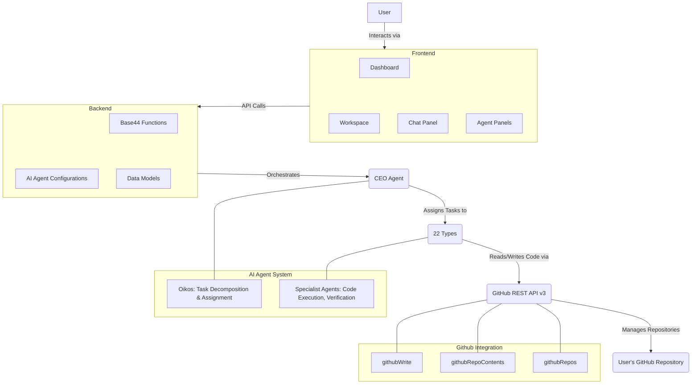

# Architecture of Consul: Autonomous Multi-Agent Coding Platform

## 1. Introduction

Consul is an autonomous multi-agent AI coding platform designed to streamline software development. It operates by decomposing complex user tasks into smaller sub-tasks, which are then delegated to specialized AI agents. These agents are capable of reading, writing, and committing code directly to connected GitHub repositories, eliminating manual intervention in many development workflows. The platform is orchestrated by a central CEO agent, Oikos, which manages the task delegation process.

## 2. High-Level Architecture

The Consul platform follows a client-server architecture, with a React-based frontend interacting with a Deno serverless backend. The core intelligence resides in a system of AI agents, coordinated by an orchestrator, that leverage GitHub API for code interactions.



## 3. Key Components and Modules

### 3.1. Frontend (React + Vite)

The user interface for Consul is built using React with Vite for fast development and optimized builds. Tailwind CSS is used for styling, following an "Editorial Mono" theme.

*   **Pages (`src/pages/`):**
    *   `Landing.jsx`: Public-facing marketing page.
    *   `Dashboard.jsx`: Manages repository connections and provides an overview.
    *   `Workspace.jsx`: The primary interface for interacting with Oikos and specialist agents, displaying chat and agent activities.
    *   `Plans.jsx`: Manages subscription plans and agent access.
    *   `Login.jsx`, `Register.jsx`: Authentication flows, including email/password and Google OAuth.
*   **Components (`src/components/`):** Reusable UI elements such as `ChatMessages.jsx`, `AgentPanel.jsx`, `FileTree.jsx`, `RepoPicker.jsx`, `CodeBlock.jsx`, and `ActivityFeed.jsx` for displaying agent operations.
*   **Utilities (`src/lib/`):**
    *   `plans.js`: Defines available plans, agents, and their metadata.
    *   `AuthContext.jsx`: Provides authentication context across the application.
    *   `query-client.js`: Configures the React Query client for data fetching and caching.
*   **API Client (`src/api/base44Client.js`):** Initializes and manages the Base44 SDK client for interacting with the backend.

### 3.2. Backend (Deno Serverless Functions)

The backend is implemented using Deno serverless functions, hosted within the Base44 platform. These functions provide the core logic for GitHub interactions and agent execution.

*   **Functions (`base44/functions/`):**
    *   `githubWrite/entry.ts`: Provides CRUD (Create, Read, Update, Delete) operations on files within a connected GitHub repository. This is the primary mechanism for agents to interact with the codebase.
    *   `githubRepoContents/entry.ts`: Indexes a connected repository, extracting its file tree, key configuration files, and detecting the technology stack.
    *   `githubRepos/entry.ts`: Lists the user's available GitHub repositories.
*   **Agent Configurations (`base44/agents/`):** JSONC files defining the behavior, roles, and prompts for each AI agent, including Oikos and the 22 specialist agents.
*   **Entities (`base44/entities/`):** JSONC schema definitions for data models used by the platform:
    *   `Project.jsonc`: Stores metadata about connected repositories, including file tree and detected stack.
    *   `Session.jsonc`: Maps CEO conversations to specific project contexts.

### 3.3. AI Agent System

This is the intelligent core of Consul, comprising a CEO orchestrator and a suite of specialist agents.

*   **Oikos (CEO Orchestrator):** The central decision-making agent. It receives user tasks, analyzes them with full project context (repo, stack, file tree), decomposes them into sub-tasks, and generates structured `[ASSIGNMENTS]` JSON for specialist agents. Oikos does not write code itself but manages the workflow.
*   **Specialist Agents (22 types):** Each specialist agent is designed for a specific engineering domain (e.g., `ui_builder`, `backend_engineer`, `architect`). They execute assigned sub-tasks by following a standardized workflow:
    1.  **READ:** Fetch relevant files from the GitHub repository using `githubWrite(operation: "read")`.
    2.  **WRITE:** Create or modify code files, committing directly via `githubWrite(operation: "write")`.
    3.  **VERIFY:** Re-read a created/modified file to confirm the commit landed successfully.
    4.  **DONE:** Provide a brief summary of their completed work.

## 4. Technology Stack

*   **Frontend:**
    *   React.js
    *   Vite (Build Tool)
    *   Tailwind CSS (Styling Framework)
    *   React Query (Data Fetching/Caching)
*   **Backend:**
    *   Deno (JavaScript/TypeScript Runtime for Serverless Functions)
    *   Base44 SDK (Platform for running agents and functions)
*   **Version Control Integration:** GitHub API v3 (REST)
*   **Language:** TypeScript (for Deno functions), JavaScript/JSX (for React)

## 5. Data Models

The platform uses simple JSONC-based data models for key entities:

*   `Project.jsonc`: Captures essential information about a user's connected repository, such as `repo_full_name`, `repo_name`, `repo_url`, `stack`, `file_tree`, and `architecture_notes`.
*   `Session.jsonc`: Links user sessions or conversations with the active project, managing context for Oikos.

## 6. Key Integrations

*   **GitHub:** Primary integration for code reading, writing, and version control. All code interactions happen through the GitHub API, exposed via Base44 functions.
*   **Base44 Platform:** Hosts the Deno serverless functions and provides the runtime environment for the AI agents. It also facilitates the structured interaction between agents and tools (like `githubWrite`).

## 7. File Structure

The project follows a modular structure, separating frontend, backend functions, and agent configurations:

```
consul/
├── src/                          # Frontend (React + Tailwind)
│   ├── pages/                    # Application pages
│   ├── components/               # Reusable UI components
│   ├── lib/                      # Utility functions and contexts
│   ├── api/                      # Base44 SDK client
│   ├── App.jsx                   # Main React router
│   ├── index.css                 # Global styles
│   └── main.jsx                  # React entry point
│
├── base44/                       # Backend (Deno) and Agent Definitions
│   ├── agents/                   # AI Agent Configurations (Oikos + Specialists)
│   ├── functions/                # Deno Serverless Functions
│   │   ├── githubWrite/
│   │   ├── githubRepoContents/
│   │   └── githubRepos/
│   │
│   └── entities/                 # Data model schemas
│       ├── Project.jsonc
│       └── Session.jsonc
│
├── index.html                    # Application shell
├── package.json                  # Frontend dependencies and scripts
├── vite.config.js                # Vite build configuration
├── tailwind.config.js            # Tailwind CSS configuration
├── postcss.config.js             # PostCSS configuration
├── jsconfig.json                 # JavaScript configuration
├── eslint.config.js              # ESLint configuration
└── README.md                     # Project README (source for this document)
```

## 8. Architectural Decisions

*   **Multi-Agent Paradigm:** The core architectural decision is the use of a multi-agent system orchestrated by a CEO (Oikos). This allows for complex tasks to be broken down and handled by specialized, autonomous units, promoting modularity and scalability for different types of coding tasks.
*   **Serverless Backend (Deno + Base44):** Leveraging Deno serverless functions on the Base44 platform provides benefits like automatic scaling, reduced operational overhead, and a modern JavaScript/TypeScript runtime. This choice simplifies deployment and management of the backend logic and agent functions.
*   **Direct GitHub Integration:** Agents interact directly with GitHub via its API. This decision ensures that all changes are version-controlled, auditable, and seamlessly integrated into existing developer workflows without requiring manual copy-pasting or intermediate steps. The `githubWrite` function serves as the atomic unit of code modification.
*   **Declarative Agent Configuration:** Agent behaviors and roles are defined in `.jsonc` files. This approach makes agent logic transparent, easily configurable, and extensible without requiring code changes to the core platform for new agents or role adjustments.
*   **Reactive Frontend (React + React Query):** The choice of React with React Query enables a highly interactive and performant user interface, with efficient data fetching, caching, and real-time updates critical for displaying ongoing agent activities.
